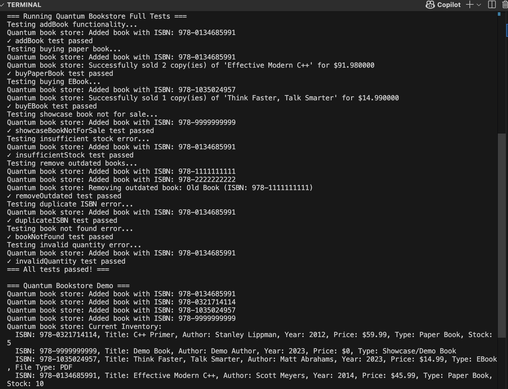
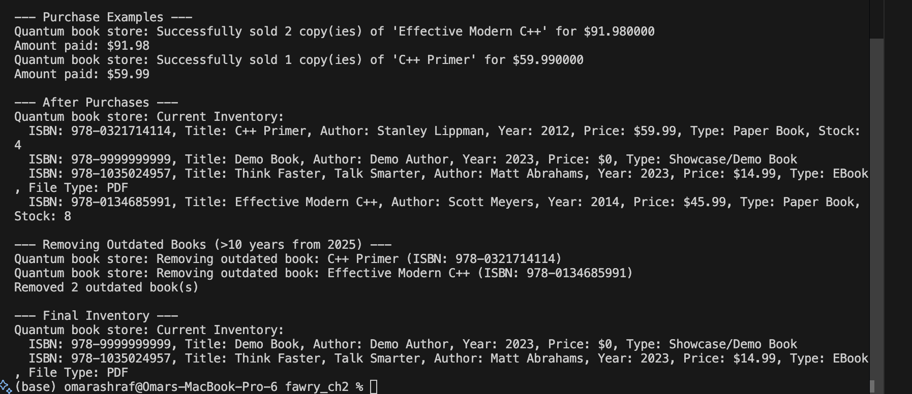

# Quantum Bookstore
A C++ implementation of an online bookstore system that demonstrates object-oriented design principles, polymorphism, and extensibility. 

## Features

### Book Types
- **Paper Book**: Physical books with stock management and shipping capability
- **EBook**: Digital books with file type specification and email delivery
- **Showcase/Demo Book**: Display-only books that cannot be sold

### Core Operations
- **Add Book**: Add any type of book to the inventory with ISBN, title, year, price, and author
- **Remove Outdated**: Automatically remove books older than a specified threshold
- **Buy Book**: Purchase books with proper inventory management and delivery processing

### Design Highlights
- **Extensible Architecture**: Easy to add new book types without modifying existing code
- **SOLID Principles**: Clean separation of concerns and single responsibility
- **Modern C++17**: Uses smart pointers, move semantics, and modern C++ features
- **Error Handling**: Comprehensive exception handling for edge cases
- **Polymorphism**: Virtual functions for type-specific behavior
- **Modular Structure**: Clear separation between headers and implementations for better organization

## Architecture

The Bookstore follows a clean, object-oriented architecture with clear separation of concerns:

```
┌─────────────────────────────────────────────────────────────┐
│                    Client Application                       │
│                       (main.cpp)                           │
└─────────────────────┬───────────────────────────────────────┘
                      │
┌─────────────────────▼───────────────────────────────────────┐
│                QuantumBookstore                             │
│              (Business Logic Layer)                         │
│  ┌─────────────────────────────────────────────────────────┤
│  │ • addBook()           • removeOutdated()                │
│  │ • buyBook()           • printInventory()                │
│  └─────────────────┬───────────────────────────────────────┘
                      │
┌─────────────────────▼───────────────────────────────────────┐
│                   Book (Abstract)                           │
│                 (Domain Model)                              │
│  ┌──────────────┬──────────────┬──────────────────────────┐ │
│  │  PaperBook   │    EBook     │    ShowcaseBook          │ │
│  │              │              │                          │ │
│  │ • stock      │ • fileType   │ • not for sale           │ │
│  │ • shipping   │ • email      │ • display only           │ │
│  └──────────────┴──────────────┴──────────────────────────┘ │
└─────────────────────┬───────────────────────────────────────┘
                      │
┌─────────────────────▼───────────────────────────────────────┐
│                External Services                            │
│               (Integration Layer)                           │
│  ┌─────────────────────────────────────────────────────────┤|
│  │ ShippingService::ship()                                 │|
│  │ MailService::sendEmail()                                │|
│  └─────────────────────────────────────────────────────────┘|
└─────────────────────┬───────────────────────────────────────┘
```

## Screenshots

### Application Build and Test Execution


### Demo Application Output


## Project Structure

```
fawry_ch2/
├── include/                 # Header files directory
│   ├── Book.h              # Abstract base class for all books
│   ├── BookTypes.h         # Concrete book type declarations
│   ├── Services.h          # External service interfaces
│   ├── QuantumBookstore.h  # Main bookstore class declaration
│   └── QuantumBookstoreFullTest.h # Comprehensive test suite
├── src/                    # Implementation files directory
│   ├── Book.cpp           # Book class implementation
│   ├── BookTypes.cpp      # Book type implementations
│   ├── Services.cpp       # Service implementations [Placeholders for now]
│   ├── QuantumBookstore.cpp # Bookstore implementation
│   └── QuantumBookstoreFullTest.cpp # Test implementations
├── screenshots/           # Application screenshots
├── main.cpp              # Demo application
├── Makefile             # Build configuration
└── README.md            # This file
```

## Building and Running

### Prerequisites
- C++17 compatible compiler 
- Make utility

### Build Commands
```bash
# Build the project
make

# Build and run
make run

# Clean build artifacts
make clean
```

## Usage Example

```cpp
#include "include/QuantumBookstore.h"

int main() {
    QuantumBookstore store;
    
    // Add different types of books
    auto paperBook = std::make_unique<PaperBook>(
        "978-0134685991", "Effective Modern C++", 2014, 45.99, "Scott Meyers", 10);
    
    auto ebook = std::make_unique<EBook>(
       "978-1035024957", "Think Faster, Talk Smarter", 2023, 14.99, "Matt Abrahams", "PDF");
    
    store.addBook(std::move(paperBook));
    store.addBook(std::move(ebook));
    
    // Purchase books
    double amount = store.buyBook("978-0134685991", 2, 
        "test@test.com", "Cairo, Egypt");
    
    // Remove outdated books
    auto outdated = store.removeOutdated(2025, 10);
    
    return 0;
}
```

## Testing

The project includes a comprehensive test suite (`QuantumBookstoreFullTest`) that covers:
- Adding books to inventory
- Purchasing different book types
- Stock management for paper books
- Error handling for invalid operations
- Removing outdated books
- Edge cases and validation

Tests are automatically run when executing the main program.

## Extensibility

The design supports easy extension for new product types:

1. Create a new class header in `include/` inheriting from `Book`
2. Implement the class in `src/` with the pure virtual functions:
   - `processPurchase()`: Define delivery/fulfillment logic
   - `canBeSold()`: Specify if the book type is sellable
   - `getType()`: Return a string identifier for the type
3. Add any type-specific properties and methods
4. Include the new header in `BookTypes.h` or create a separate header

Example:
```cpp
// include/AudioBook.h
#pragma once
#include "Book.h"

class AudioBook : public Book {
private:
    std::string narrator;
    int durationMinutes;
    
public:
    AudioBook(const std::string& isbn, const std::string& title, int year,
              double price, const std::string& author, 
              const std::string& narrator, int duration);
    
    void processPurchase(const std::string& customerEmail, 
                        const std::string& shippingAddress) const override;
    bool canBeSold() const override;
    std::string getType() const override;
};

// src/AudioBook.cpp
#include "include/AudioBook.h"
#include "include/Services.h"

void AudioBook::processPurchase(const std::string& customerEmail, 
                               const std::string& shippingAddress) const {
    // Send download link via email
    MailService::sendEmail(customerEmail);
}
```

